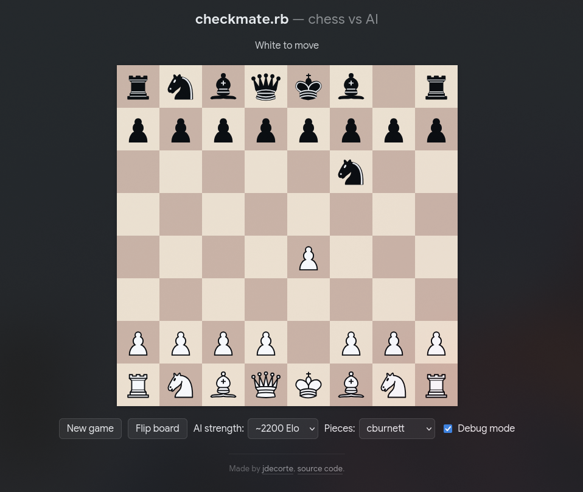
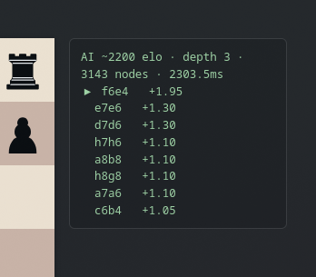

# checkmate.rb

[](https://github.com/jdecorte-be/checkmate/actions/workflows/test.yml)

A chess game where you play White against a Ruby-built AI opponent, or 1v1 against a friend, served by a small Sinatra app with a from-scratch chess engine — no external chess library.



## Features

- Fully legal move generation: check, checkmate, stalemate, castling, en passant, and promotion
- FEN-based game state, kept server-side in the session
- AI opponent using negamax search with alpha-beta pruning and a material + piece-square-table evaluation
- Adjustable AI strength (illustrative Elo tiers, tuned via search depth and move randomness)
- Click-to-move and drag-and-drop board, with a choice of piece sets and file/rank coordinates that flip with orientation
- 1v1 with a friend: "Play a friend" creates a room and a 5-character code to send them; they join with the code and each side can only move its own pieces, on its own turn. There's no websocket, so the opponent's moves show up via polling (~1.2s)
- 10-minute clock per side in 1v1 games, tracked server-side so both players see the same time regardless of their own browser; running out of time ends the game for that side
- The UI clearly distinguishes the two modes — the subtitle, clock, and AI-only controls (strength, debug mode) switch depending on whether you're playing the AI or a friend

## Requirements

- Ruby 3.4.10 (see `Gemfile`)
- Bundler

## Setup

```sh
bundle install
```

## Run

```sh
bundle exec puma config.ru
```

Then open `http://localhost:9292`.

## Debug mode

Check the "Debug mode" box in the UI to see what the AI is thinking after each of its moves: engine strength (Elo), search depth, node count, time spent, and the top-scoring candidate moves (or a note when the AI deliberately blunders, per its Elo tier's blunder rate). Under the hood this sends `debug=1` to `/api/ai_move`, which asks `Ai::Engine#choose_move` for its `:debug` payload instead of just the chosen move.



## Why the engine doesn't search deeper

Each Elo tier in `Ai::Engine::LEVELS` caps search at a modest depth (1-5 plies) within a short time budget (1-6s). A few reasons compound to keep it shallow:

- **Synchronous HTTP request** — `POST /api/ai_move` blocks until the search returns, so search time is directly page-load latency. There's no background job or websocket to search asynchronously, hence the hard per-move time budget and the `SearchTimeout` that aborts a mid-iteration search once the deadline passes.
- **Move generation dominates per-node cost** — the move generator is plain Ruby (array/FEN-based, no bitboards), and it's needed at every node, including quiescence captures. That makes each additional ply expensive in wall-clock time.
- **Deliberate Elo simulation** — lower tiers are shallow on purpose (plus blunder chance and score noise) to emulate weaker play, not just to save time.
- **No transposition table** — iterative deepening re-searches each depth from scratch with no cache of previously-seen positions, so work isn't reused across iterations.
- **Ruby itself** — single-threaded, no compiled hot path, which caps achievable nodes/sec versus a native engine.

To search deeper, the highest-leverage changes would be a transposition table, a bitboard-based move generator, and moving the search off the request thread (background job + polling/websocket) so the time budget isn't tied to HTTP latency.

## Test

```sh
bundle exec rake
```

## Project structure

```
app.rb              Sinatra app / HTTP API
lib/chess/          Board, move generation, and game rules
lib/ai/             Search-based AI opponent
lib/rooms/          In-memory 1v1 room registry (share codes, turn state)
public/             Frontend (HTML/CSS/JS) and piece sets
spec/                RSpec tests
```

## License

[MIT](LICENSE)
